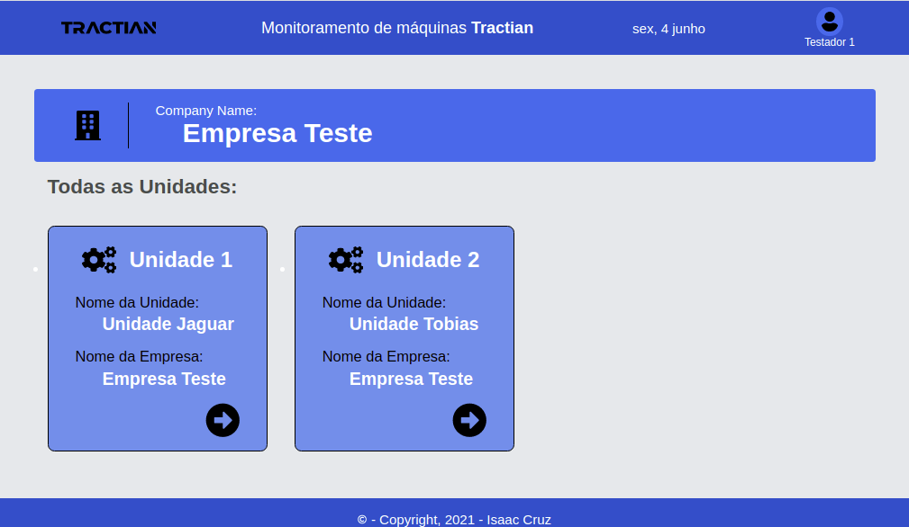
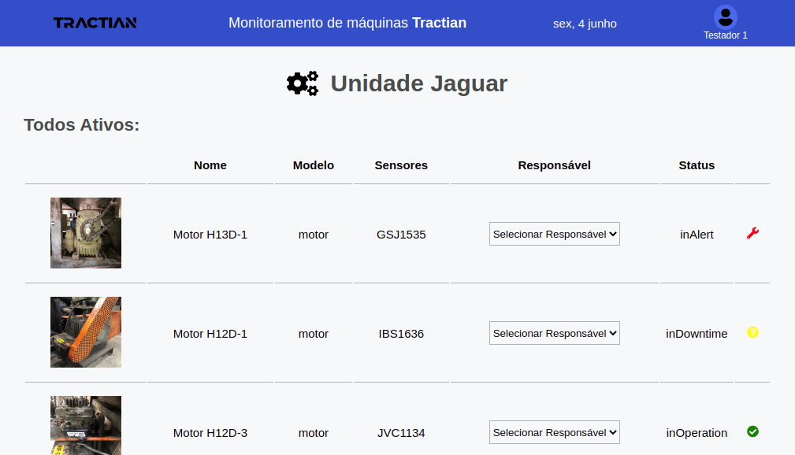

  <a href="#-tecnologias">Tecnologias</a>&nbsp;&nbsp;&nbsp;|&nbsp;&nbsp;&nbsp;
  <a href="#-projeto">Projeto</a>

 

  
  

## 🚀 Tecnologias

Esse projeto foi desenvolvido com as seguintes tecnologias:

- ReactJS
- Next.js
- HTML
- SCSS
- TypeScript
- Highcharts

## 💻 Projeto

Este projeto foi desenvolvido para a apresentação e participação do processo seletivo da Tractian (https://tractian.com/);

---

